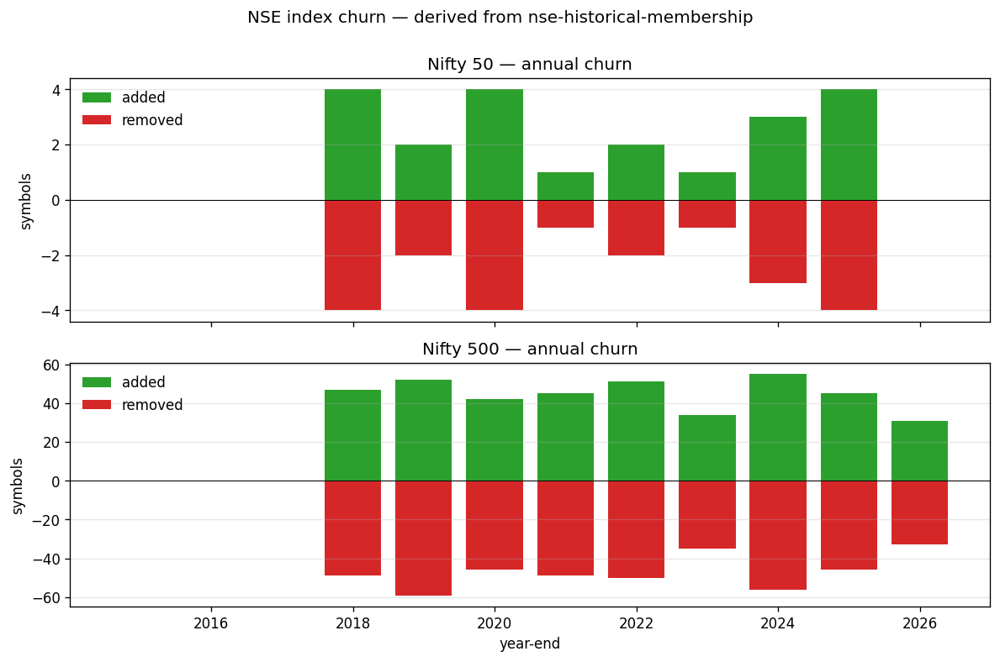

# NSE Historical Membership (Point-in-Time)

[](https://github.com/aditya-jha/nse-historical-membership/actions/workflows/ci.yml)
[](LICENSE)
[](LICENSE-DATA)

Open-source point-in-time membership tables for NSE (India) — **42 equity indices** across broad-market, sector, strategy and thematic families, plus **F&O segment membership** — derived by parsing public NSE press releases and circulars. The repo also ships two adjacent NSE datasets built the same way: **point-in-time quarterly shareholding** (`shareholding_history/`) and **cash-market daily OHLC** (`nse_eod/`).

<!-- COVERAGE:START — generated by `python -m tools.build_coverage`; do not hand-edit -->
**Data freshness** (auto-generated → [`COVERAGE.md`](COVERAGE.md)): index membership through **2026-05-15** · F&O through **2026-04-01** · shareholding through **2026-04** · last validated **2026-05-22**.
<!-- COVERAGE:END -->



For backtests on Indian equities, you cannot ask "was X in Nifty 500 on 2021-08-15?" today using NSE's own portal — they publish only the current snapshot. This repository fills that gap.

## Data quality at a glance

| Check | Status |
|---|---|
| Famous-transition test (29 PIT facts across all four index families) | **29/29 PASS** |
| Snapshot match — `members(today, idx)` == NSE published CSV | **0/42 mismatches** |
| Internal consistency — Nifty 100 ⊆ Nifty 500, sectors ⊆ Nifty 500, etc. | 13/20 invariants drift on some pre-2018 dates |
| Wayback cross-check — Nifty 50 reconstruction vs Wayback snapshots | mean drift 0.0 across 5 snapshots |
| Pre-2018 daily cardinality | ±2 to ±13 symbols (walk-back drift; closes with R1b seed) |
| Pytest suite (`pytest tests/`) | **16/16 PASS** |

Run the test suite yourself: `pip install pandas pytest && pytest tests/`.

## Try it in 30 seconds

```bash
git clone https://github.com/aditya-jha/nse-historical-membership && cd nse-historical-membership
pip install pandas
python examples/quickstart.py
```

This answers 5 PIT questions out of the box (HDFC pre/post-merger, Nifty 50 on a specific date, Nifty 500 churn 2020→2024, ZOMATO→ETERNAL inclusion, JIOFIN F&O entry).

## What's in here

```
index_history/
├── data/
│   ├── index_membership_history.csv     # ← headline file (~6,730 intervals across 42 indices)
│   ├── index_registry.json              # source of truth for which indices we track
│   ├── current_snapshot/                # NSE's authoritative current CSVs (the seed)
│   ├── parsed/                          # one JSON per parsed press release
│   └── manual_overrides/                # mergers, renames, hand-curated edits
├── code/                                # fetch / parse / build / validate
└── docs/
    ├── EXPERIMENT_LOG.md
    └── validation_report.md             # latest validation run

fno_history/
├── data/
│   ├── fno_membership_history.csv       # ← headline file (311 intervals, 270 symbols)
│   └── parsed/                          # one JSON per parsed circular
├── code/
└── README.md

shareholding_history/
├── data/
│   ├── parsed/_flat.csv                 # ← headline file (PIT quarterly shareholding, 2,261 symbols)
│   ├── parsed/_signals.csv              # latest-quarter snapshot + derived signals per symbol
│   ├── filings_index/                   # one JSON per symbol: its full SHP-filing URL list
│   └── _universe.csv                    # self-contained NSE universe (2,910 symbols)
├── code/                                # fetch_filings / download_xbrl / parse_xbrl / build_signals / validate
└── README.md

nse_eod/                                 # code-only — outputs are rebuilt, not shipped (see below)
├── code/                                # fetch_bhavcopy / build_daily_ohlc
└── README.md

examples/
├── quickstart.py                        # 5 PIT queries in 30 lines
└── plot_churn.py                        # regenerates docs/churn.png

tests/
└── test_pit_lookups.py                  # 16 asserts (famous transitions + invariants)

CHANGELOG.md · CONTRIBUTING.md · ROADMAP.md
```

## Headline CSVs

### `index_history/data/index_membership_history.csv`

Half-open intervals: `(index_id, index_name, symbol, valid_from, valid_to, source)`. A NULL `valid_to` means the symbol is currently in that index. Query pattern:

```sql
-- Was X in Nifty 500 on 2021-08-15?
SELECT 1 FROM index_membership_history
 WHERE index_name='Nifty 500' AND symbol='MINDTREE'
   AND valid_from <= '2021-08-15'
   AND (valid_to IS NULL OR valid_to > '2021-08-15');
```

Or in pandas:

```python
import pandas as pd
df = pd.read_csv('index_history/data/index_membership_history.csv', parse_dates=['valid_from', 'valid_to'])
def member(index_name, symbol, on):
    on = pd.Timestamp(on)
    m = df[(df.index_name==index_name) & (df.symbol==symbol)
           & (df.valid_from<=on) & (df.valid_to.isna() | (df.valid_to>on))]
    return not m.empty
```

### `fno_history/data/fno_membership_history.csv`

Half-open intervals: `(symbol, valid_from, valid_to, source, source_url, circular_no, notes)`. NULL `valid_to` = currently in F&O segment. A symbol may have multiple intervals (re-introduction after exclusion).

## Two more datasets (same repo, same provenance model)

Alongside the two membership tables, the repo ships two adjacent NSE datasets built the same way — derived facts redistributed, raw bulk sources rebuilt from NSE on demand. Each has its own `README.md` with the full schema and caveats.

### `shareholding_history/` — point-in-time quarterly shareholding

A PIT table of quarterly shareholding patterns (promoter, FII, DII, public, pledge) per NSE-listed symbol, parsed from the SHP **XBRL filings** NSE publishes. NSE's own portal only exposes the most recent ~9 quarters per symbol; this reconstructs the **full disclosure history** (typically 20+ years) so you can reconstruct institutional ownership at any past quarter-end.

| | |
|---|---|
| Headline file | `shareholding_history/data/parsed/_flat.csv` — `(ticker, period, promoter_pct, fii_pct, dii_pct, public_pct, pledge_pct)` |
| Derived signals | `parsed/_signals.csv` — latest-quarter snapshot + 4-quarter deltas + `smart_money_score = fii_d4q + dii_d4q` |
| Coverage (committed) | **2,261 symbols**, periods **2001-03 → 2026-04** (108 quarters) |
| Filing index | `data/filings_index/*.json` — one per symbol, its full list of filing → XBRL URLs (2,918 symbols) |
| Universe | `data/_universe.csv` — self-contained NSE universe (2,910 symbols), no external dependency |
| Not redistributed | the ~16 GB raw XBRL corpus (`data/xbrl/`) — rebuilt via the fetch scripts |

The parsed CSVs are committed, so for most uses you don't need to rebuild anything — just read `_flat.csv`. `validate.py` can cross-check the parse against an external reference export you supply via `--reference` (optional; not shipped).

### `nse_eod/` — cash-market daily OHLC (code-only)

A daily NSE cash-market bhavcopy → consolidated long-format OHLC + turnover table covering the full universe (main board + SME Emerge), no auth, no Cloudflare. **Unlike the other three modules, no output data is committed** — the consolidated table is ~half a GB, so you rebuild it locally from NSE's bhavcopies. Supported window: **2020-01-01 → today** via `sec_bhavdata_full`. Output schema (`data/_daily_ohlc.parquet`): `symbol, date, series, open, high, low, close, last, prev_close, avg_price, volume_shares, turnover_inr, n_trades`. See `nse_eod/README.md`.

## Data dictionary

| Column | Meaning |
|---|---|
| `index_id` | NSE Indices Ltd internal id. Broad (217–227), sector (1001–1015), strategy (2001–2010), thematic (3001–3011). Full mapping in `index_history/data/index_registry.json`. |
| `index_name` | Canonical human-readable name |
| `symbol` | NSE trading symbol, **canonicalised to the terminal name in any rename chain** (e.g., MINDTREE → LTIMindtree → LTM is stored as LTM throughout). See `index_history/data/manual_overrides/symbol_renames.json`. |
| `valid_from`, `valid_to` | Half-open interval `[valid_from, valid_to)`. NULL `valid_to` = currently a member. |
| `weightage` | Free-float weight at the time of the snapshot (only populated for currently-open intervals; NULL for historical) |
| `source` | One of: `circular` (parsed NSE PR), `merger` (manual override for a merger), `snapshot_floor` (interval predates our coverage window — start date is approximate), `inferred-exclude` (interval was open but symbol is not in NSE's current published list, so it was force-closed at the next semi-annual review), `snapshot` (inferred-include — symbol is in current snapshot but no inclusion PR was found, opened at the most recent semi-annual review) |
| `source_url` | NSE publication URL the interval is derived from, where available |
| `notes` | Human-readable provenance (e.g. "closed by ind_prs28022024.pdf") |

Filter on `source` if you want to exclude lower-confidence rows: `source IN ('circular', 'merger')` keeps only PR-backed intervals.

## Coverage and known gaps

**Index history** — high confidence from **2017 onward** across all 42 indices. Coverage tiers:

| Family | Indices | Coverage notes |
|---|---|---|
| Broad | 7 (Nifty 50, Next 50, 100, 500, Midcap 150, Smallcap 250, Microcap 250) | Best — extensive PR coverage 2014+, dense semi-annual reviews. Microcap 250 (launched 2019-04) reliable 2021-10+ where its PR coverage begins; earlier walk-back over-counts |
| Sector | 15 (Bank, IT, FMCG, Pharma, Auto, Metal, Realty, Energy, PSU Bank, Private Bank, Healthcare, Financial Services, Media, Consumer Durables, Oil & Gas) | Good 2017+, sparser 2014–2016 |
| Strategy | 9 (Alpha 50, High Beta 50, Low Volatility 50, Nifty50 Value 20, Nifty100 Equal Weight / Low Volatility 30 / Quality 30, Midcap 50, Smallcap 50) | Good 2017+; pre-2018 cardinality drifts because NSE reviews these quarterly with ~10-stock churn |
| Thematic | 11 (Commodities, Consumption, CPSE, Infrastructure, MNC, PSE, Services, India Manufacturing, India Defence, Tata 25% Cap, MAATR) | Good post-launch; some thematics launched 2021+ so historical coverage is short by design |

**Validation status** (run `python -m index_history.code.validate`):

- **G1 snapshot match**: **0/42** indices have today-vs-published drift.
- **G2 internal consistency** (Nifty 100 ⊆ Nifty 500, sectors ⊆ Nifty 500, etc.): some pre-2018 violations from walk-back drift.
- **G3 famous transitions**: **29/29 PASS**. HDFC merger (2023-07), ZOMATO→ETERNAL (2025-03), INDIGO/MAXHEALTH inclusion (2025-09), HEROMOTOCO/INDUSINDBK exclusion (2025-09), MINDTREE→LTIM→LTM, ADANIGAS→ATGL, sector membership today (TCS in Nifty IT, MARUTI in Nifty Auto, ONGC in Nifty CPSE, etc.). Every transition that has ever been documented in the wild reconciles correctly.
- **G4 cardinality**: clean 2018+; drifts ±2–13 on pre-2018 dates (R1b in `ROADMAP.md`).
- **G5 Wayback cross-check**: Nifty 50 reconstruction has **mean drift 0.0** vs Wayback Machine snapshots of NSE's official constituent CSVs.

**Current member counts** (per-index, in [`COVERAGE.md`](COVERAGE.md)): most indices' open-interval count equals their target, but a few differ and are flagged ⚠️ there. Notably **Nifty 500 currently ships 499**, not 500 — one constituent is absent from NSE's current published list (G1 still matches that published list set-for-set). Sector and thematic indices have **no `target_size`** in the registry (NSE doesn't fix their size), so G4 cardinality is not enforced for them and `COVERAGE.md` shows their actual count instead.

The walk-back is **seeded from NSE Indices' authoritative published CSVs** (`archives.nseindia.com/content/indices/ind_nifty*list.csv`) for indices with static mirrors, and from `nseindia.com/api/equity-stockIndices` JSON for the rest. Two reconciliation steps run after walk-forward:

1. Any open interval whose symbol is NOT in NSE's current list is force-closed at the next semi-annual review (`source='inferred-exclude'`).
2. Any symbol in NSE's current list but absent from our walk-forward (because it was excluded then re-included in a PR we didn't parse) is re-opened at the most recent semi-annual review (`source='snapshot'`, notes `inferred-include`).

Filter on `source IN ('circular', 'merger')` to keep only PR-backed intervals.

**F&O history** — coverage starts **2014**. Symbols added pre-2014 and never excluded since are absent (we don't have an introduction event for them). Of NSE's ~220 currently-tradeable F&O names, this dataset captures 140 in the open intervals; the gap is overwhelmingly long-tenured names like RELIANCE, INFY, TCS that have been in F&O since well before 2014.

See `index_history/docs/validation_report.md` and `fno_history/README.md` for full caveats.

## How it was built

Two independent pipelines because the underlying publishers are different entities:

|                | index_history                                   | fno_history                                        |
|----------------|-------------------------------------------------|----------------------------------------------------|
| Publisher      | NSE Indices Limited                             | NSE Exchange                                       |
| URL            | `niftyindices.com/Press_Release/`               | `nsearchives.nseindia.com/content/circulars/`      |
| Discovery      | `niftyindices.com/press-release?date=YYYY`      | `nseindia.com/api/circulars?dept=FAO`              |
| Anti-bot       | none                                            | session cookies (warm via homepage GET)            |
| File type      | PDF                                             | PDF, sometimes inside `.zip` bundles               |
| Approach       | walk **backward** from current snapshot via PR-driven replacement events, with manual overrides for mergers and rename events | walk **forward** through introduction/exclusion events, half-open intervals |

For image-only PDFs (older NSE press releases were scanned), the parser falls back to `pdftoppm` + `tesseract` OCR.

## Rebuild from source

The raw PDFs are **not** redistributed (NSE owns the underlying publications; we redistribute only the parsed facts). To rebuild from scratch:

```bash
git clone https://github.com/aditya-jha/nse-historical-membership
cd nse-historical-membership
python -m venv venv && source venv/bin/activate
pip install -r requirements.txt

# tesseract for image-only PDFs (optional but recommended)
brew install tesseract poppler              # macOS
# sudo apt install tesseract-ocr poppler-utils    # Linux

# Index history (CSV-only mode, no database needed)
python -m index_history.code.fetch_nse_snapshot          # current authoritative seed from NSE
python -m index_history.code.fetch_press_releases        # cache PRs locally (~1100 PDFs)
python -m index_history.code.parse_all                   # PDF -> parsed/*.json
python -m index_history.code.build_history --csv-out index_history/data/index_membership_history.csv

# F&O history
python -m fno_history.code.fetch_circulars
python -m fno_history.code.parse_circulars
python -m fno_history.code.build_history                 # see fno_history/README for CSV mode

# Shareholding history (parsed CSVs are committed; rebuild only if you want fresh data)
python -m shareholding_history.code.fetch_filings --all   # per-symbol XBRL URL index (uses committed _universe.csv offline)
python -m shareholding_history.code.download_xbrl --workers 4   # bulk XBRL fetch (~16 GB, resumable)
python -m shareholding_history.code.parse_xbrl            # XBRL -> data/parsed/_flat.csv
python -m shareholding_history.code.build_signals         # -> _qoq_delta.csv + _signals.csv

# EOD cash-market OHLC (no data shipped — this generates it)
python -m nse_eod.code.fetch_bhavcopy --start 2020-01-01 --end today   # daily bhavcopies (resumable)
python -m nse_eod.code.build_daily_ohlc                   # union -> data/_daily_ohlc.parquet
```

If you have a Postgres backend you can also run `build_history` without `--csv-out` and `validate` to check against an `index_equity_map_archive` table; the CSV-out mode is the path with no infrastructure dependencies. The `parsed/*.json` files are the portable intermediate output.

## Legal

The factual contents — dates, symbols, index/F&O membership — are derived from publicly-published NSE press releases and SEBI-mandated circulars. Facts are not copyrightable in India (cf. *Eastern Book Co. v. D.B. Modak*, 2008 SCC). What is original to this repository — the parsing, normalization, and PIT reconciliation — is offered under the licenses below.

The **raw NSE press release / circular PDFs** themselves remain the property of their respective publishers and are intentionally **not** redistributed in this repository. Use the fetch scripts to obtain them directly from NSE.

Index names ("Nifty 50" etc.) are trademarks of NSE Indices Limited. This project is independent of, not affiliated with, and not endorsed by NSE Indices Limited or NSE Exchange.

**Code:** [MIT](LICENSE) — `LICENSE`
**Data:** [CC BY 4.0](LICENSE-DATA) — `LICENSE-DATA`

## Disclaimer

This data is provided "as-is" with documented coverage gaps. **Independently verify any output before relying on it for trading, research, or compliance.** The authors assume no liability for trading losses, regulatory issues, or any other consequences arising from use of this data.

## Contributing

See [`CONTRIBUTING.md`](CONTRIBUTING.md) for the five contribution paths and PR conventions, and [`ROADMAP.md`](ROADMAP.md) for an explicit list of open tasks (R1–R12) ranked by leverage. Highest-impact contributions: backfilling pre-2017 NSE Indices PRs (R1), pre-2014 F&O introductions (R2), and adding sector indices like Nifty Bank / Nifty IT (R3).

To request a new task or report a data-quality issue, open a GitHub Issue. Issues that block production use of the dataset jump the queue.

## Citation

If this dataset informs published research or a derivative work:

```bibtex
@misc{nse_historical_membership_2026,
  author       = {Jha, Aditya},
  title        = {{NSE} Historical Membership (Point-in-Time)},
  year         = {2026},
  howpublished = {\url{https://github.com/aditya-jha/nse-historical-membership}},
  note         = {Derived from public NSE Indices Limited press releases
                  and NSE Exchange circulars. CC BY 4.0.}
}
```

Plain-text form:

> Jha, A. (2026). *NSE Historical Membership (Point-in-Time)*. GitHub. https://github.com/aditya-jha/nse-historical-membership

The CC BY 4.0 license requires attribution. A link to this repository plus the citation above satisfies the license; a [Zenodo DOI](ROADMAP.md#r11--zenodo-doi-registration) will be added at v0.1.0 tag for academic-style citations.

## Used by

If your work depends on this dataset, open an Issue with `[Used by]` in the title — we'll add a line here. Empty until the first user adds themselves.
